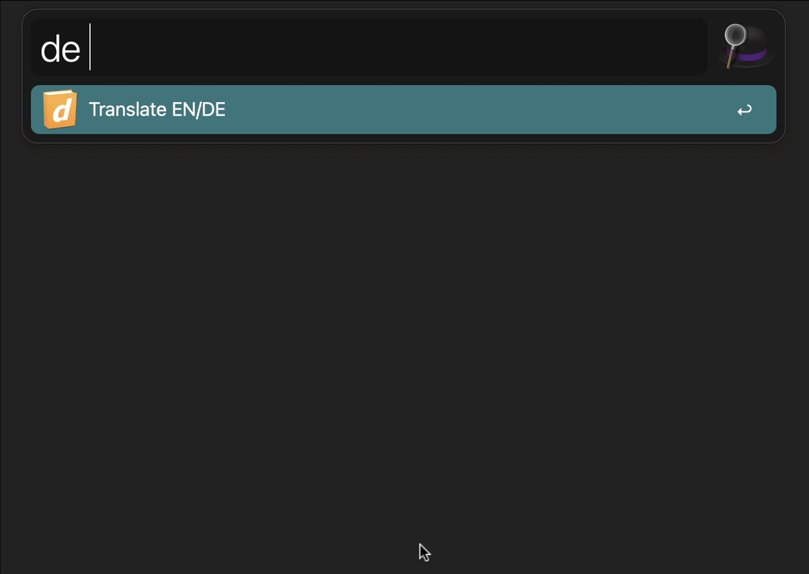

# dict

A quarkus based CLI tool to do quick translation-lookups (en/de vs de/en) based on [www.dict.cc](https://www.dict.cc)

## Usage 
```bash
./dict running
Term: running
======================================================================
running                                 laufend
running                                 ununterbrochen
running                                 fließend
running                                 fortlaufend
running                                 funktionierend
running                                 nacheinander
running                                 laufend
running                                 Laufen
running                                 Betrieb
running                                 Gang
running                                 Joggen
running                                 Rennen
running                                 Laufsport
running                                 Laufarbeit
running                                 Lauf
running                                 Arbeitsgang
running                                 Versuch
running                                 Gerenne
running                                 Leitung
coming running                          herbeieilend
```

### Using the tool behind a proxy
The CLI tool tries to discover the proper proxy-settings by reading the `HTTPS_PROXY` environment variable (and also supports proxies that require basic auth).
If you're executing the tool outside of a shell-environment or if the auto-discovery doesn't work properly you can hand-over the required proxy settings explicitly via respective options (see `--help`):

```bash
#  in that case I'd recommend a wrapper-bash-function
./dict --proxy-host proxy.muc --proxy-port 8080 running
```

### Output-formats and Alfred integration

The initial reason for me to create that script was an [Alfred](https://www.alfredapp.com)-Workflow for quick translation that stopped working for me (due to MacOS dropping `python`-support). Hence, the CLI tool supports three output-formats at the moment (one specifically for Alfred).

## Installation

1. Checkout the repository and make sure you have all pre-requisites for compiling to native code
    1. GraalVM (tested with version `22.1.0.r17`)
    2. make sure you can compile to native images with that installation (i.e. `gu install native-image`)
2. next compile the code to native image and generate the binaries using `./buildAll.sh`
3. in the `target` folder you should see now a `dict` binary
    1. move that binary to our `$PATH`
       
## Developement

As already mentioned - this project makes use of Quarkus and PicoCLI to create a native executable.

- used for active development (also use the `e`-key to define and re-execute a specific command)
   ```shell script
   ./mvnw compile quarkus:dev
   ```
    - As picocli applications will often require arguments to be passed on the commandline, this is also possible in dev mode via:
      ```shell script
      ./mvnw compile quarkus:dev -Dquarkus.args='-o alfred running'
      ```
      Also for picocli applications the dev mode is supported. When running dev mode, the picocli application is executed and on press of the Enter key, is restarted.
- Creating a native executable
   ```shell script
   ./mvnw package -Pnative
   ```
    - Or, if you don't have GraalVM installed, you can run the native executable build in a container using (produces a linux-binary):
       ```shell script
       ./mvnw package -Pnative -Dquarkus.native.container-build=true
       ```

You can then execute your native executable with: `./target/dict-1.0.0-SNAPSHOT-runner` - it's recommended to rename or define an alias for the final result

### Produce a Autocompletion-Script

In order to generate a auto-complete script you could execute the followin' command:
```bash
$> cd target/quarkus-app
$> java -cp $(ls lib/main | awk '{print "lib/main/" $1}' | tr "\n" ":")../dict-1.0.0-SNAPSHOT.jar picocli.AutoComplete de.bender.dict.boundary.DictCommand
```
I'd like to integrate that into the ordinary build-process (maven based).

### Related Guides

- Picocli ([guide](https://quarkus.io/guides/picocli)): Develop command line applications with Picocli

## Alfred integration
Although there is already a `dict`-workflow for Alfred I was eager to make my own experiences (for educational purposes mainly).

I've initially provided a `workflow`-definition in this repo as well as an export (as described [in here][workflow-on-github] - out-of-the-box only for Intel-Macs).



[workflow-on-github]:https://www.alfredapp.com/blog/guides-and-tutorials/share-workflow-on-github/
